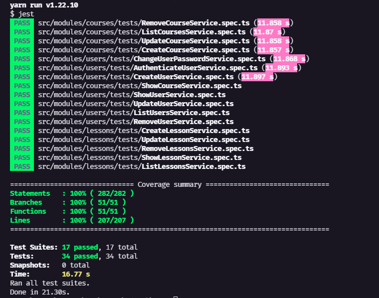

<h1 align="center">
  
</h1>

[POSTMAN WORKSPACE - Acesse as requisições aqui](https://www.postman.com/speeding-trinity-534186/workspace/eduick/overview)

### 🛠 Tecnologias

- [TypeScript](https://www.typescriptlang.org/)
- [Express](https://expressjs.com/pt-br/)
- [Prisma](https://www.prisma.io/)
- [Postgres](https://www.postgresql.org/)
- [TSYRinge](https://github.com/microsoft/tsyringe)
- [Jest](https://jestjs.io/pt-BR/)

#### Pré-requisitos

- [Node.js](https://nodejs.org/en/)
- [Docker](https://www.docker.com/)

### ✔ Como executar os testes



```bash
# Clone este repositório
$ git clone https://github.com/srsantosdev/eduick-challenge-api

# Acesse a pasta do projeto no terminal
$ cd eduick-challenge-api

# Instale as dependências
$ yarn

# Execute os testes
$ yarn test
```

### 🖥️ Como executar o projeto

```bash
# Clone este repositório
$ git clone https://github.com/srsantosdev/eduick-challenge-api

# Acesse a pasta do projeto no terminal
$ cd eduick-challenge-api

# Instale as dependências
$ yarn

# Crie a instancia do postgres com o docker
$ docker compose up -d

# Execute as migrations
$ yarn migrate:dev

# Execute a aplicação em modo de desenvolvimento
$ yarn dev:server

# Acesse http://localhost:3333

# Você tambem pode executar a aplicaçao otimizada para produção.
# Para isso, execute:
$ yarn build

# e em seguida
$ yarn start

# Acesse http://localhost:3333
```
